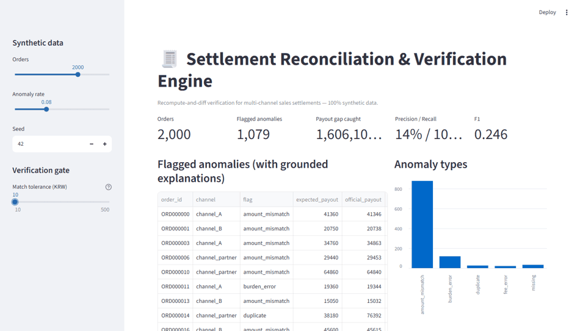
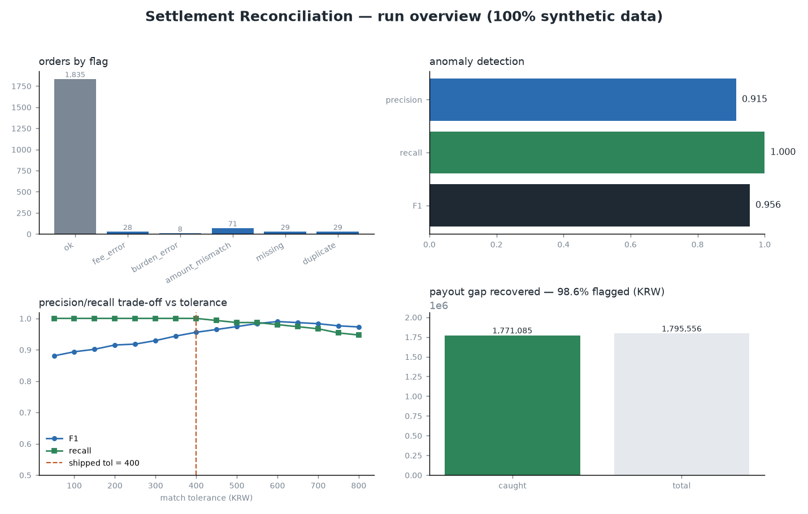
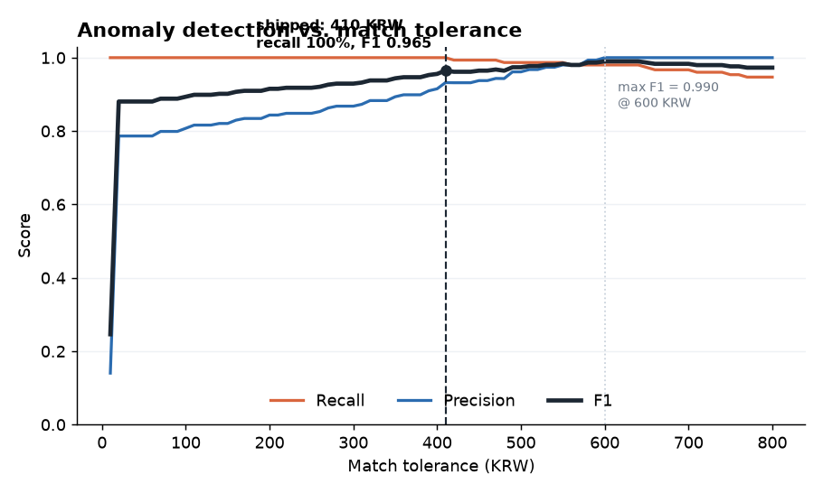

# Settlement Reconciliation & Verification Engine

[](https://github.com/cloudavenue0012-creator/settlement-reconciliation-engine/actions/workflows/ci.yml)


Recompute-and-diff verification for **multi-channel sales settlements**. The engine
never trusts the number a channel reports — it reconstructs the *expected* payout
for every order from first principles (order value + channel fee/discount rules),
diffs it against the channel's official settlement file, and flags the gaps:
wrong commission, mis-assigned discount burden, missing rows, double-counting,
and unexplained amount errors.

> **100% synthetic data.** Orders, stores, channel names, and fee rules are all
> randomly generated / illustrative (see `synth_data.py`, `rules.yaml`). No real
> company data, code, schemas, or figures are included. This repo is a portable
> re-implementation of a production pattern, built to be inspected.



*Slide the match tolerance and watch precision / recall trade off in real time.*
`streamlit run app.py`, or [deploy your own](#interactive-demo) on Streamlit Community Cloud.

## Why this exists

A merchant selling across delivery apps, partner platforms, and direct/POS
receives a settlement file from each channel and is expected to trust it. But
fees change, promo-funding splits are misapplied, and rows silently go missing or
get duplicated — each one a small, hard-to-notice cash leak. Manually spot-checking
thousands of orders doesn't scale. The fix is a **verification gate**: independently
recompute what each payout *should* be, and only trust matches within tolerance.

## Architecture

```
orders.csv ─┐
            ├─► reconstruct expected payout ─► match vs official ─► classify anomaly ─► verification gate ─► eval
rules.yaml ─┘        (settlement_rules.py)       (reconcile.py)        (fee/burden/          (flag)          (eval.py)
official_settlement.csv ─────────────────────────────────────────────  missing/dup/amount)
```

- **`settlement_rules.py`** — the canonical payout formula (`gross − commission − merchant_discount_burden`), shared by generator and reconciler so neither can drift.
- **`synth_data.py`** — generates orders + an official settlement file with *planted* discrepancies and a ground-truth label file. Noise is mostly small, with a heavy tail that **deliberately overlaps** the small end of the planted errors, so no threshold can separate them cleanly.
- **`reconcile.py`** — the engine: reconstructs expected payout, matches, classifies each anomaly type.
- **`eval.py`** — scores the engine against ground truth (the differentiator).

## Results (2,000 orders, ~8% planted anomalies, `--seed 42`, tolerance 400)

| metric | value |
|---|---|
| reconciliation accuracy (clean within tolerance) | 99.2% |
| anomaly recall | 100.0% |
| anomaly precision | 91.5% |
| F1 | 0.956 |
| false-positive rate | 0.8% |
| payout gap recovered | 1,771,085 / 1,795,556 KRW (98.6%, synthetic) |
| per-type recall | 100% on all five discrepancy types |

Reproduce with the Run block below; CI asserts these on every push. Numbers vary by `--seed`.



*One-glance run overview (`python dashboard.py`): flag mix, detection scoreboard, the tolerance trade-off, and the share of the KRW payout gap the engine flags.*

## Run

```bash
pip install -r requirements.txt
pytest -q                         # unit tests: every anomaly class + generator determinism + recall floor
python synth_data.py -n 2000      # -> data/orders.csv, official_settlement.csv, ground_truth.csv
python reconcile.py               # -> data/reconciliation.csv
python eval.py                    # -> metrics report
python tune.py                    # -> docs/tuning_curve.png + both operating points
python dashboard.py               # -> docs/dashboard.png (static run overview)
python explain.py --demo-hallucination   # grounded explanations + faithfulness eval
streamlit run app.py              # interactive dashboard
```

## Interactive demo

`streamlit run app.py` — regenerate synthetic settlements and reconcile them live.
Slide the **match tolerance** and watch precision/recall move in real time; the
flagged-anomaly table carries a grounded explanation and a faithfulness score per row.
Data is generated in-process (no shelling out, no disk), so it deploys cleanly.

**Deploy your own:** push to GitHub, then on [share.streamlit.io](https://share.streamlit.io)
pick this repo → branch `main` → `app.py`. (Runtime pinned via `requirements.txt`.)

## Continuous integration

`.github/workflows/ci.yml` runs the **unit tests** (`pytest` — every anomaly class, generator
determinism, and an end-to-end recall floor) and then the full pipeline on every push,
**failing the build if quality regresses** — `eval.py --min-f1 0.93 --min-recall 0.99` — then
checks that the explanation layer's faithfulness scorer still catches a hallucinated figure.
Eval is a gate, not an afterthought.

The thresholds sit just under the shipped numbers on purpose. An earlier version gated at
`--min-f1 0.80 --min-recall 0.90`, which the generator flaw described below made
effectively unfailable — a green badge asserting quality on a benchmark that could not
go red.

## The benchmark was rigged, and finding that was the real result

An earlier version of `synth_data.py` drew its heavy-tail noise as
`randint(tol + 10, tol * 3)` — where `tol` is the match tolerance the evaluation
is meant to *judge*. The difficulty of the benchmark therefore moved with the
parameter under test, and every tolerance scored about the same.

`rigged_benchmark_demo.py` reproduces both generators side by side. The tell is
the false-positive rate, not F1:

| tolerance | FPR (rigged) | FPR (fixed) |
|---:|---:|---:|
| 50 | 0.0208 | 0.0195 |
| 200 | 0.0208 | 0.0125 |
| 800 | 0.0208 | 0.0000 |

Widening the band 50 → 800 removes **0%** of the false positives under the rigged
generator and **100%** under the fixed one. A tolerance that swallows no extra
noise as it widens is not being measured at all.

The general form: **if the data generator reads the parameter you are evaluating,
your benchmark cannot rank settings of that parameter.** Sweep the parameter and
look at the shape — a sound benchmark trades precision against recall, a rigged
one is flat. (F1 spread is *not* a reliable tell here; both generators produce a
similar spread. That was measured, not assumed.)

```
python rigged_benchmark_demo.py   # no args, no network, synthetic data only
```

## Choosing the tolerance

The match tolerance is the only free parameter in the engine: below it a gap is
rounding noise, above it an anomaly. `tune.py` scores every value against ground truth
so the number is an argued choice, not a default nobody revisited.



```
 tol(KRW)    prec  recall      F1   FP   FN
      100   80.7%  100.0%   0.893   36    0
      200   84.4%  100.0%   0.915   28    0
      400   91.5%  100.0%   0.956   14    0   <- shipped
      410   93.2%  100.0%   0.965   11    0   <- widest tolerance with full recall
      500   96.1%   98.7%   0.974    6    2
      600  100.0%   98.0%   0.990    0    3   <- max F1
      800  100.0%   94.7%   0.973    0    8
```

**F1 peaks at 600, and that is the wrong operating point.** Getting there means missing
3 real discrepancies to avoid 14 reviews. In settlement work a false negative is cash
permanently lost; a false positive costs someone a minute. So the engine ships at
max-recall rather than max-F1 — optimising F1 here would trade money for tidiness.

Full recall survives up to 410. The engine ships **400**, one step inside that boundary,
so a small change in the fee rules or the noise profile does not silently push the
operating point across into missed anomalies.

### The benchmark was rigged, and fixing it was the real finding

An earlier version of this repo reported **F1 0.879 at tolerance 50**, and the sweep made
it look like tuning to ~150 achieved a near-perfect F1. That result was an artifact. The
generator drew its heavy-tail noise as `randint(tol + 10, tol * 3)` — **the noise
distribution depended on the very tolerance being evaluated.** Measured on the old
generator:

- every false positive sat inside `[tol + 10, tol * 3]`, and no clean row ever exceeded `tol * 3`
- so precision snapped to *exactly* 1.000 the moment the tolerance passed that manufactured band
- regenerating the data at tolerance 50 / 200 / 400 moved precision only 78.5% / 78.6% / 78.1%

A benchmark whose difficulty tracks the parameter being tuned measures the generator, not
the detector — and the knob it advertises as tunable provably cannot move precision. The
fix was to make noise an absolute range (60–600 KRW) that overlaps the small planted
errors (30–15,000 KRW), so some noise is indistinguishable from a real discrepancy at
*any* threshold. That is what puts a genuine knee in the curve above instead of a plateau
at 1.000.

The honest metrics are the ones in Results, and the CI gate had to be raised to stay
meaningful. That is the point.

## Explanation layer + faithfulness eval

`explain.py` turns each flagged anomaly into a grounded, plain-language reason
("under-paid by 4,120 KRW: expected …, settled …; the merchant was charged for a
platform-funded promo"). The differentiator is the **faithfulness scorer**: every
figure an explanation cites must trace back to the reconciliation record, or it's
counted as ungrounded. `--demo-hallucination` injects a fake total to show the
scorer actually catches it (faithfulness drops below 1.0) rather than rubber-stamping
the output — the same guard keeps an LLM rephrasing layer honest.

## Roadmap

- **Overlap-severity sweep** — the noise/error overlap band is currently one hand-set range; parameterise it and show how detectability degrades as the two distributions converge.
- **LLM rephrase backend** — swap the template explainer for a model call, gated by the existing faithfulness eval.
- **Config-driven rules** — load channel rules from a live source instead of a static YAML.
- **Streaming reconciliation** — reconcile settlements as they arrive rather than in batch.

## 한국어 요약

**다채널 매출 정산 대사·검증 엔진.** 배달앱·제휴·직영 등 여러 채널이 통보한 정산 금액을 그대로
신뢰하지 않고, 주문·수수료·할인부담 규칙으로 **기대 정산액을 독립적으로 재계산(recompute)** 한 뒤
채널의 공식 정산과 **대조(diff)** 해 오차를 잡아내는 "검증 게이트" 파이프라인입니다.

- **잡아내는 이상 유형** — 수수료 오류(`fee_error`)·할인부담 오류(`burden_error`)·정산 누락(`missing`)·중복 정산(`duplicate`)·설명 안 되는 금액 차이(`amount_mismatch`)
- **허용오차(tolerance) 튜닝** — 임계값을 스윕해 정밀도(precision)·재현율(recall)·F1의 트레이드오프에서 운영점을 *선택*합니다 (`tune.py`, `docs/tuning_curve.png`).
- **설명 + faithfulness 평가** — 각 이상 건에 근거 기반 자연어 설명을 붙이고, 설명이 인용한 모든 숫자가 대사 레코드로 추적되는지 점수화해 환각(없는 숫자 지어내기)을 잡습니다 (`explain.py`).
- **CI 게이트** — 매 push마다 파이프라인을 돌려 품질(F1·recall)이 임계 아래로 떨어지면 빌드를 실패시킵니다.
- **벤치마크 결함 자체 발견·수정** — 초기 버전은 노이즈를 평가 대상인 허용오차에 종속시켜 생성해, 어떤 임계값을
  써도 정밀도가 오르는 구조였습니다. 이를 실측으로 확인해 절대범위 노이즈로 교체했고, 그 경위와 수치 변화를
  README에 그대로 남겼습니다.

> 실제 운영 중인 사내 정산 재현·검증 시스템을 **회사 데이터 없이 합성 데이터로 동형 재현**한 것입니다.
> 실제 채널명·부담율·금액·스키마는 일절 포함하지 않습니다.

## License

MIT. Synthetic data only.
